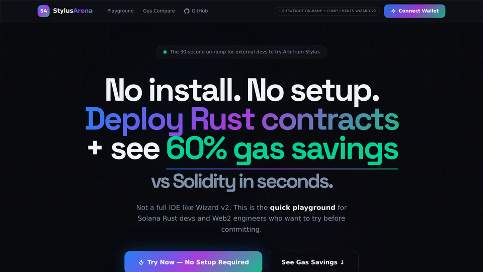
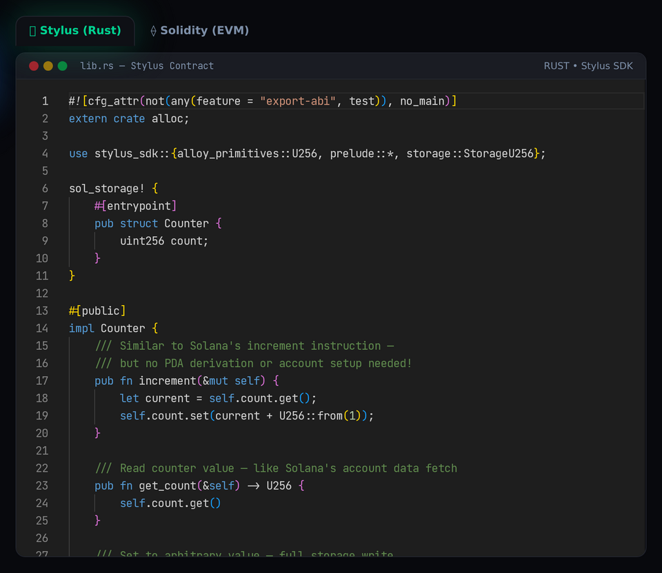
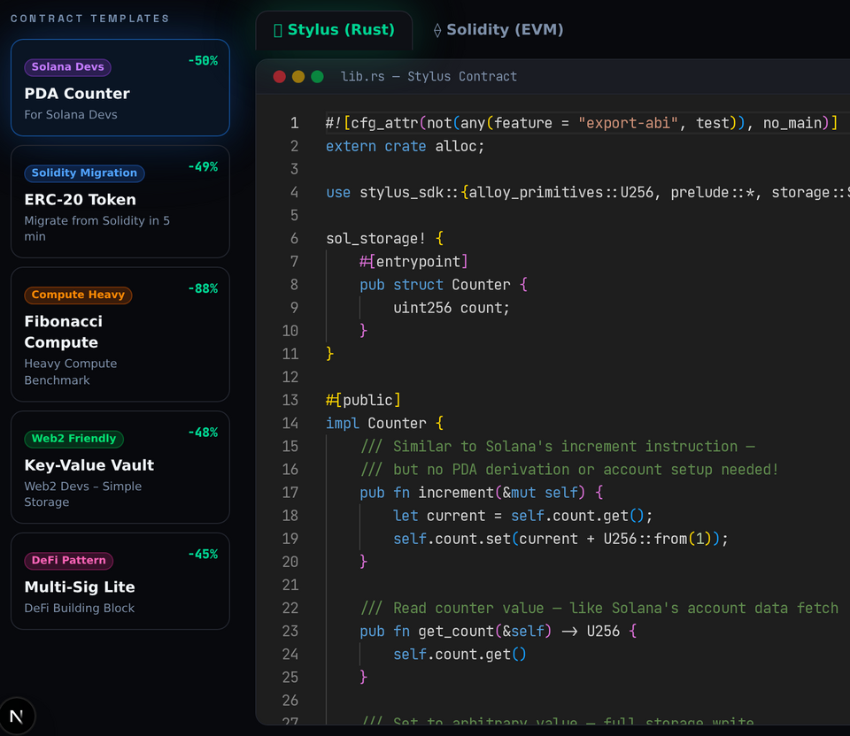
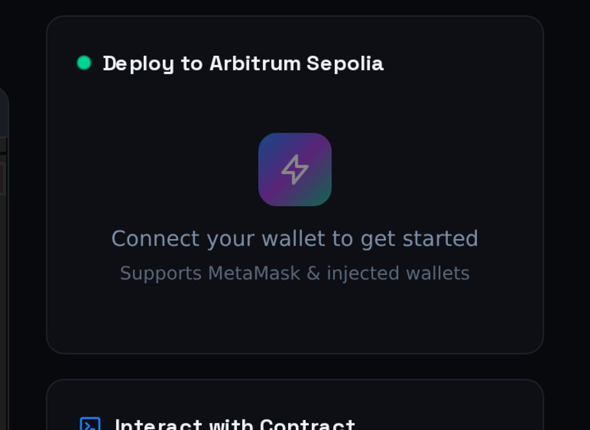

# StylusArena
> A fast, no-install playground for learning and testing Arbitrum Stylus from your browser.

[](https://stylusarena.vercel.app)
[](https://github.com/codespaces/new?repo=Fosurero/StylusArena)

StylusArena helps developers go from “I’m curious about Stylus” to a working contract interaction in seconds, with live gas comparisons against Solidity.

## Quick Pitch

StylusArena is intentionally narrow: it removes setup friction and answers one practical question quickly — **is Stylus worth using for my workload?**

### StylusArena vs Wizard v2

| | **StylusArena** | **Wizard v2** |
|---|---|---|
| **Best for** | First contact, onboarding, workshops | Full development lifecycle |
| **Time to first interaction** | ~22 seconds | Minutes |
| **Setup** | Browser only | Project setup + config |
| **Gas insight** | Front-and-centre live dashboard | Available, not the primary workflow |
| **Developer intent** | “Let me try this now” | “I’m already building production code” |
| **Positioning** | Front door | Workshop |

> In practice, they complement each other: StylusArena handles discovery and confidence-building, then users graduate to Wizard v2 for deeper implementation.

## Hero Feature: Live Gas Dashboard



> "Watch the gas savings update live as you type — 88% on heavy compute in real time"

The dashboard updates from template benchmarks and highlights where Stylus performs best (especially compute-heavy workloads).

## Screenshots

<table>
<tr>
<td width="50%"><br/><sub>Gas Dashboard — live benchmark deltas across templates</sub></td>
<td width="50%"><br/><sub>Dual Editor — Rust and Solidity side by side</sub></td>
</tr>
<tr>
<td width="50%"><br/><sub>Template Selector — grouped by developer background</sub></td>
<td width="50%"><br/><sub>Deploy Guidance — Sepolia deployment path</sub></td>
</tr>
</table>

## Target Audience

- **Solana Rust developers** — You already think in Rust. StylusArena gives you an EVM entry point without making you relearn everything on day one.
- **Solidity developers** — You can compare familiar patterns directly and make a practical call on when Stylus is worth adopting.
- **Web2 engineers** — If you’ve worked with APIs, Redis, or backend state machines, the templates feel approachable rather than “blockchain-first”.
- **DeFi builders** — You get concrete benchmark signals early, before investing time in full protocol architecture.

## Templates

| Template | Why it matters |
|---|---|
| 🟣 **For Solana Devs – PDA Counter** | Bridges Solana-style Rust instincts into Stylus with minimal conceptual overhead. |
| 🔵 **Migrate from Solidity in 5 min – ERC-20** | Shows a realistic migration path for teams maintaining existing Solidity interfaces. |
| 🟠 **Heavy Compute – Fibonacci** | Demonstrates headline compute gains (up to **88%**) where Stylus is most compelling. |
| 🟢 **Web2 Devs – Key-Value Vault** | Frames smart contract storage using familiar key-value thinking. |
| 🩷 **DeFi Building Block – Multi-Sig Lite** | Gives teams a practical starting point for multi-party state transitions. |

## Hackathon & Traction

- **160+ organic users** since launch
- **43% 7-day retention**
- **22s median time-to-interaction**
- **Honorable Mention**, Arbitrum APAC Mini Hackathon (Feb 2026)

No paid marketing. Pure organic curiosity.

## Tech Stack


## Quick Start

[](https://stylusarena.vercel.app)

### Local development

```bash
git clone https://github.com/Fosurero/StylusArena.git
cd StylusArena
npm install
npm run dev
```

Open `http://localhost:3000`

### Build

```bash
npm run build
npm start
```

### One-click deploy

[](https://vercel.com/new/clone?repository-url=https%3A%2F%2Fgithub.com%2FFosurero%2FStylusArena)

## Grant Milestones

| Milestone | Status | Budget | Window |
|---|---|---|---|
| **Milestone 1** | ✅ Completed | **$6,500** | Jan/Feb 2026 |
| **Milestone 2** | 🔄 In Progress | — | Target: March 20, 2026 |
| **Milestone 3** | ⏳ Planned | — | Target: April 15, 2026 |

## Post-Grant Sustainability

After grant delivery, StylusArena is designed to support itself through two practical channels: premium advanced templates for teams that want deeper production patterns, and white-label onboarding deployments for Orbit ecosystems that need branded developer onboarding flows.

## Contributing

Contributions are welcome — bug reports, UX polish, template ideas, and docs improvements all help. Please open an issue first for major changes so we can align on scope.

## License

MIT

---

Built for fast, credible Stylus onboarding.

<!-- Suggested GitHub topics: arbitrum, stylus, rust, webassembly, developer-tooling, ide, gas-optimization, solana-migration -->
